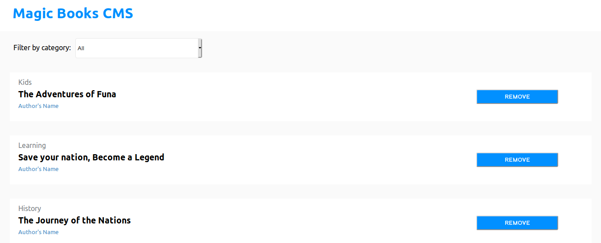

# Bookstore for Magic-Books Inc 

> A front-end React & Redux application for the organization and management of a bookstore for Magic-Books Inc.

## Built With

  - Node.js
  - React
  - React-DOM
  - React-Create-App
  - Redux
  - npm
  - CSS
  - ES6

## Live Demo

[Live Demo Link](https://mbi-bookstore.herokuapp.com/)

## Getting Started

To get a local copy up and running follow these simple steps.

### Prerequisites
  - Node.js

### Setup & Install
- Clone this repository and `cd` into the project folder.
- Run `npm install`
- Run `npm start` 
- If all goes well, App will open in your browser.

## Features
- User can add books to the library, grouped by categories.
- User can remove books from the library.
- User can filter books based on category.

## Upcoming Features
- Rails back-end for persisting books storage.
- Tracking book read progress.

## Author

👤 **Moses Ogwo**

- Email: mosesogwo@gmail.com
- Github: [@mosesogwo](https://github.com/mosesogwo)
- LinkedIn: [Moses Ogwo](https://www.linkedin.com/in/mosesogwo/)
- Portfolio: [Moses Ogwo](https://mosesogwo.github.io/My-Portfolio/)

## Acknowledgments
- [Microverse](https://www.microverse.org/) - for project description and guide.

## 📝 License

This project is [MIT](http://www.tldrlegal.com/license/mit-license) licensed.
